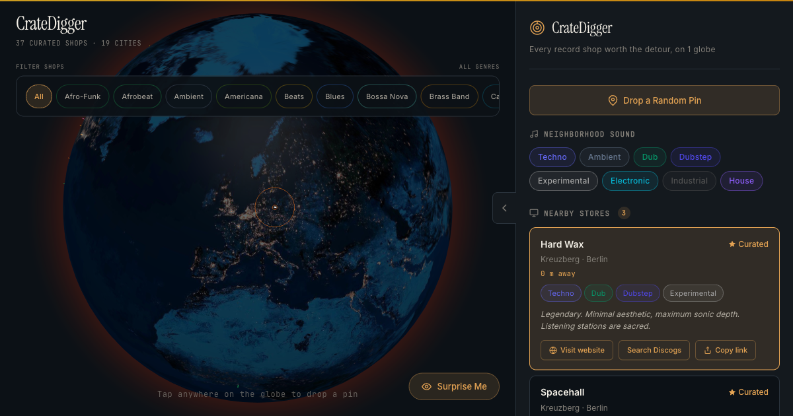

# CrateDigger

Music discovery through vinyl culture. Spin the globe, drop a pin on a city you are
about to visit, and instantly see real record stores there, each with a genre
fingerprint and a staff pick. Built for collectors who plan trips around crate digging
instead of a messy mix of Discogs tabs and saved map pins.



## What it does

- An interactive 3D globe of real record stores across 13 countries and 19 cities,
  from Rough Trade and A1 Records in New York to Hard Wax in Berlin, Amoeba in Los
  Angeles, and Disk Union in Tokyo.
- Each store card shows its neighborhood, the genres it digs deep on, a staff pick
  album with a note, and a "Visit website" link straight to the real shop.
- A genre filter to narrow the globe to the sounds you collect.
- "Surprise me" to jump to a random shop, and a per-store share link so a single
  store card travels as its own URL.

## Data and honesty

Store listings, addresses, websites, and staff picks are editorially curated, not
sourced from a live API or scraped reviews. Cards say "Curated" rather than showing a
fabricated numeric rating. The data lives in `src/data/stores.js` and is meant to be
real shops you can actually go visit and buy from.

## Tech

Static Vite plus React single page app. No backend. The globe is rendered with
react-globe.gl on top of three.js.

## Develop

```bash
npm install
npm run dev      # local dev server
npm run build    # production build to dist/
npm run preview  # preview the production build
```

## Contributing a store

Add a new object to the array in `src/data/stores.js` with a real shop: name, lat,
lng, city, country, neighborhood, genres, a staffPick, address, vibe, description,
and a website (or null). Keep it real, no invented ratings.
